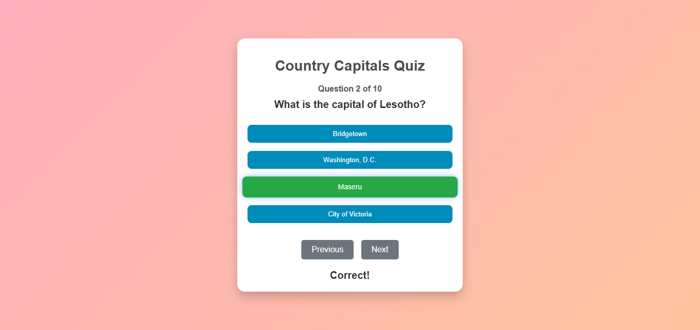
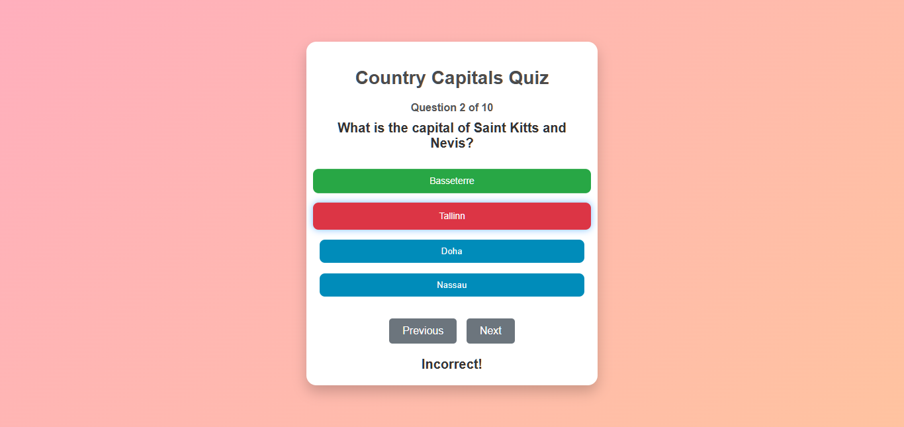
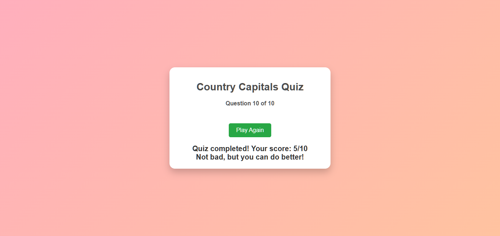

# Capital Cities Quiz App

Test your knowledge of world capitals with this interactive quiz! The app fetches country data from an external API and challenges you with 10 random questions about the capitals of different countries. Answer correctly to increase your score, and at the end, see how well you did!

## Features

- Fetches real-time country data from an API
- Displays 10 random questions about capitals
- Highlights correct answers in green and incorrect in red
- Users can review their score at the end
- Allows replay for continuous learning

## Live Demo

You can try out the quiz live here: [Live Quiz](https://ezekiel-great.github.io/Countries_Capital_Quiz/)

## Repository

Check out the code on GitHub: [Quiz App Repository](https://github.com/Ezekiel-Great/Countries_Capital_Quiz)

## How to Play

1. The app will load 10 random questions about the capitals of different countries.
2. Choose the correct capital from the available options.
3. After selecting an answer, the correct answer will be highlighted in green, and all incorrect answers in red.
4. Move to the next question by clicking **Next**.
5. At the end of the quiz, your score will be displayed along with a message based on your performance.
6. Click **Play Again** to retry and improve your score.

## Screenshots

### Question Example:

### Final Score Screen:

---

Happy quizzing! Test yourself, learn, and have fun!

